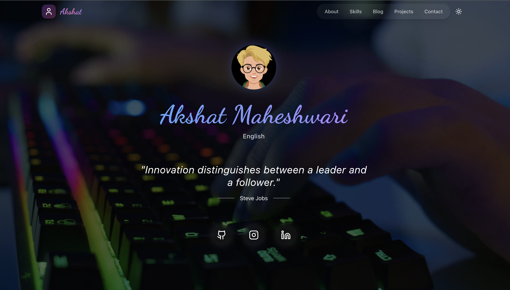

# My Portfolio (Version 3)

  
  
  <h3>✨ A Modern, Interactive Portfolio Built with React & TypeScript</h3>
  
  

    
    
    
    
    
    
    
  

  <table>
    <tr>
      <td align="center" width="96">
        <a href="#-introduction">Introduction</a>
      </td>
      <td align="center" width="96">
        <a href="#-features">Features</a>
      </td>
      <td align="center" width="96">
        <a href="#-live-demo">Live Demo</a>
      </td>
      <td align="center" width="96">
        <a href="#-tech-stack">Tech Stack</a>
      </td>
      <td align="center" width="96">
        <a href="#-sections">Sections</a>
      </td>
      <td align="center" width="96">
        <a href="#-installation">Installation</a>
      </td>
      <td align="center" width="96">
        <a href="#-contact">Contact</a>
      </td>
    </tr>
  </table>

## 🌟 Introduction

  <table>
    <tr>
      <td width="50%">
        <h4>About the Project</h4>
        

          Welcome to Version 3 of my personal portfolio! This is a comprehensive showcase of my skills, experiences, and projects. Built with modern web technologies and best practices, this portfolio offers an immersive experience with smooth animations, responsive design, and intuitive navigation.
        

      </td>
      <td width="50%">
        <h4>Key Highlights</h4>
        <ul>
          <li>🎯 Showcase professional journey</li>
          <li>🎨 Modern, clean interface</li>
          <li>⚡ Optimized performance</li>
          <li>🔄 Regular updates</li>
        </ul>
      </td>
    </tr>
  </table>

## ✨ Features

  <table>
    <tr>
      <td width="33%">
        <h4>Core Features</h4>
        <ul>
          <li>🎨 Responsive Design</li>
          <li>🌓 Theme Support</li>
          <li>⚡ Performance</li>
          <li>🎯 Interactive UI</li>
        </ul>
      </td>
      <td width="33%">
        <h4>Technical Features</h4>
        <ul>
          <li>🔄 Dynamic Content</li>
          <li>🌐 SEO Optimization</li>
          <li>📱 Accessibility</li>
          <li>🔒 Security</li>
        </ul>
      </td>
      <td width="33%">
        <h4>User Experience</h4>
        <ul>
          <li>🚀 Fast Loading</li>
          <li>💫 Smooth Animations</li>
          <li>📱 Mobile First</li>
          <li>🎨 Custom Themes</li>
        </ul>
      </td>
    </tr>
  </table>

## 🚀 Live Demo

  <table>
    <tr>
      <td align="center">
        <h3>Experience the portfolio live</h3>
        
        
<small>🌐 Live at: <a href="https://akshat17.vercel.app/">https://akshat17.vercel.app/</a></small>

        
<small>🚀 Deployed on Vercel's global edge network for optimal performance</small>

      </td>
    </tr>
  </table>

## 🛠️ Tech Stack

  <table>
    <tr>
      <td width="25%">
        <h4>Frontend</h4>
        <ul>
          <li>ReactJS (v18+)</li>
          <li>TypeScript (v5+)</li>
          <li>JavaScript (ES6+)</li>
        </ul>
      </td>
      <td width="25%">
        <h4>Styling</h4>
        <ul>
          <li>Tailwind CSS (v3+)</li>
          <li>Framer Motion</li>
          <li>Custom CSS</li>
        </ul>
      </td>
      <td width="25%">
        <h4>Tools</h4>
        <ul>
          <li>Vite</li>
          <li>ESLint & Prettier</li>
          <li>Git</li>
        </ul>
      </td>
      <td width="25%">
        <h4>Deployment</h4>
        <ul>
          <li>Vercel</li>
          <li>GitHub Actions</li>
          <li>CI/CD</li>
        </ul>
      </td>
    </tr>
  </table>

## 📂 Sections

  <table>
    <tr>
      <td width="33%">
        <h4>Main Sections</h4>
        <ul>
          <li>🎯 Hero</li>
          <li>👤 About</li>
          <li>🎓 Qualifications</li>
          <li>📜 Certifications</li>
          <li>💻 Skills</li>
        </ul>
      </td>
      <td width="33%">
        <h4>Content Sections</h4>
        <ul>
          <li>📝 Notes</li>
          <li>🖼️ Gallery</li>
          <li>🎨 Artwork</li>
          <li>🗺️ Journey</li>
          <li>💡 Inspirations</li>
        </ul>
      </td>
      <td width="33%">
        <h4>Interactive Sections</h4>
        <ul>
          <li>🎯 Future Goals</li>
          <li>😊 Fun Facts</li>
          <li>📰 Blog</li>
          <li>💬 Testimonials</li>
          <li>📞 Contact</li>
        </ul>
      </td>
    </tr>
  </table>

## ⚙️ Installation

  <table>
    <tr>
      <td width="50%">
        <h4>Prerequisites</h4>
        <ul>
          <li>Node.js (v16+)</li>
          <li>npm (v7+)</li>
          <li>Git</li>
        </ul>
      </td>
      <td width="50%">
        <h4>Setup Steps</h4>
        <pre><code># Clone the repository
git clone https://github.com/akshatmaheshwari1702/Portfolio_vite.git
cd My-Portfolio-V-03

# Install dependencies

npm install

# Start development server

npm run dev</code></pre>
</td>
</tr>

  </table>

## 🤝 Contact

  <table>
    <tr>
      <td align="center">
        <h3>Connect with me</h3>
        

          
          
          <!--  -->
        

      </td>
    </tr>
  </table>

---

  
Made with ❤️ by Akshat Maheshwari

  
© 2025 All rights reserved

  
<small>Last updated: July 2025</small>

